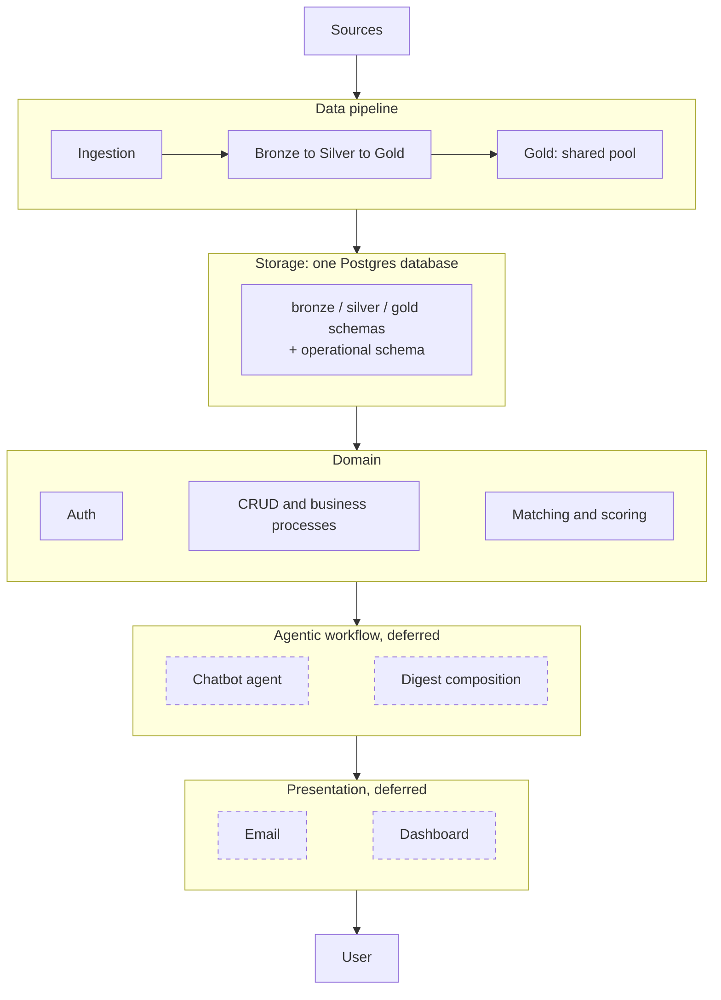
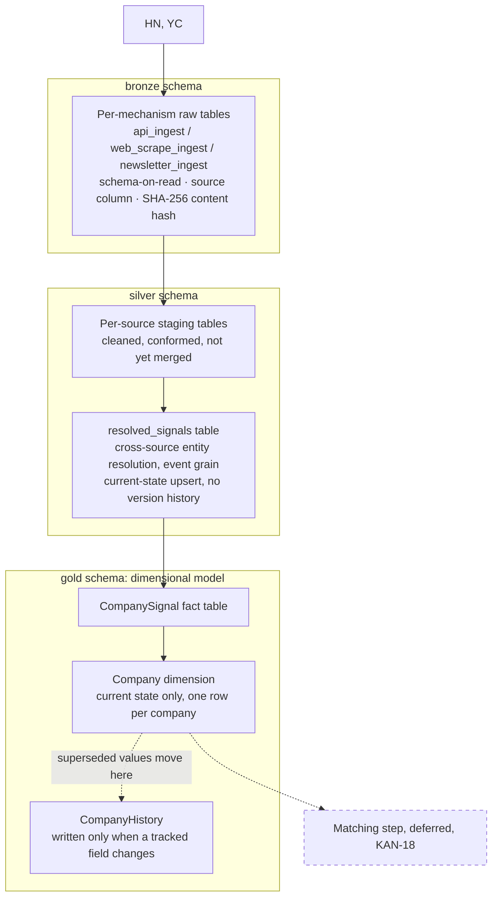
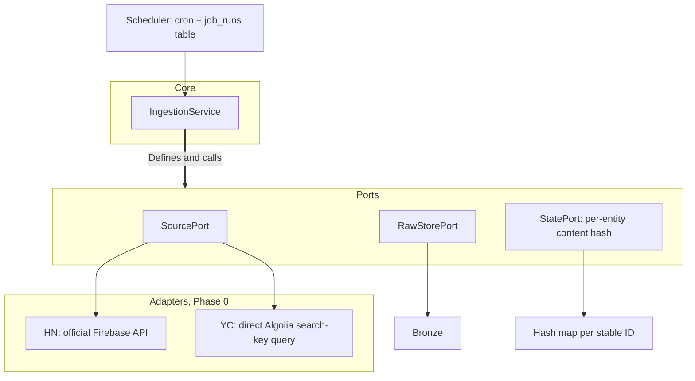
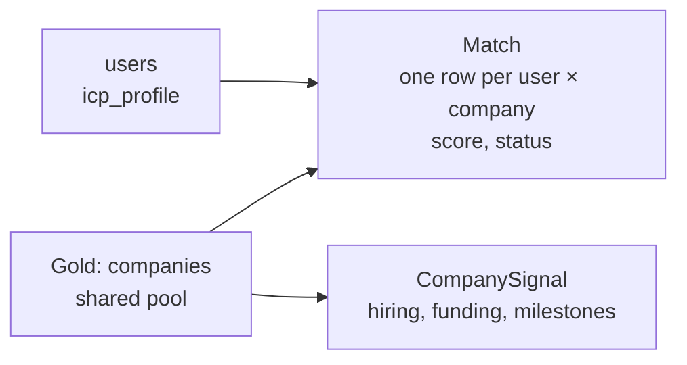

Status: DRAFT. Architecture decided across a series of design sessions, September 2026. No code written yet.
Author: Khaled Awashreh

Supersedes `huginn-diagrams.md` v1.3 wherever its "Not yet specified" table has since been resolved below. Its diagrams are the historical source for this document's graphs. This document is the authoritative, current-state architecture.

Companion documents: `huginn-concept-doc.md` (v1.3, product vision), `Entites.md` (domain schema, in progress), `architecture-notes/` (supporting research), `adr/` (decision records), Jira epic KAN-16 (tracked tech debt and research debt). Full list in section 13.

Architecture at a glance:

1. Storage: one Postgres database. Three ELT schemas (bronze, silver, gold) feed a separate operational schema.
2. Ingestion: ports and adapters, two sources at launch, HN "Who's Hiring" and the YC directory.
3. Entity resolution: runs at silver, domain-key first, Jaro-Winkler/token-Jaccard fallback.
4. Scoring: two stages. v0 ranks by recency alone. The weighted composite (v1) is deferred until there is real filtered-data volume to design against.
5. Delivery: a weekly email digest to a single user, on a data model that is multi-user from day one.
6. Out of scope this phase: everything above the domain layer (chatbot, dashboard, memory).

---

## 1. Problem and vision

Prospecting is the hardest part of running a solo services business, and often what stops people going independent at all. With no sales team it competes directly with billable work. Startups are the high-fit case and the hard case at once: they lack the org charts, headcount plans, and formal recruiting processes that make bigger companies legible from outside, so the gap is visibility, not fit. The signal exists (funding, hiring, program milestones) but is scattered and easy to miss on top of client work.

The output is a Monday-morning email: a short shortlist, not a feed to monitor, already checked against criteria the user set themselves. Each entry carries enough to decide whether it is worth a message, who the company is, why it surfaced, and a drafted outreach opener. Over time the list learns what a "yes" and a "no" actually look like for this user.

Full problem statement and vision: `huginn-concept-doc.md` sections 1 and 2, the source this summary is drawn from.

## 2. Goals and non-goals

Goals for this phase:

1. A weekly digest: a ranked shortlist of companies matching a plain-language ICP.
2. Per company: name, site, a LinkedIn search link (not scraped data), a short description, plain-language match reasoning, and a drafted outreach opener.
3. A domain model that's multi-user from day one, even though exactly one user exists right now. Phase 2 becomes additive, not a rebuild.
4. Ingestion from exactly two sources: HN "Who's Hiring" and the YC directory.

Non-goals for this phase:

1. No CRM or outreach automation. The opener is a draft to edit and send, not something the system sends on its own.
2. No chatbot UI and no conversational ICP refinement. ICP capture is a one-time plain-text-to-structured-filter form.
3. No scraped LinkedIn profile data. Search-link only. `hiQ v. LinkedIn` is the standing reason, and the same caution extends to person-level scraping generally (section 6).
4. No real-time alerts. Weekly batch by design.
5. No graph-traversal or ML model predicting a company's current needs. Team-composition signal, where it exists at all, is a hand-authored heuristic drawn only from company-owned pages and press releases.
6. No weighted composite score at launch. v0 ranks by recency alone (section 7).
7. No auth beyond a single hashed username and password. No role-based access control. No billing.

## 3. System overview

Five layers. The data pipeline feeds storage. Everything above it reads from storage.

Collection is shared infrastructure, matching is personal. The pipeline and the gold pool serve every user and are expensive to re-run, since sources rate-limit and some content becomes unavailable over time. Everything from the domain layer up is specific to one user and re-runnable at no cost.

Scoring lives in the domain layer, not the agentic layer: it is batch work, it must stay explainable per feature because the digest renders its reasoning, and both the digest and any future chatbot read its output rather than each other's.

## 4. Data pipeline: bronze, silver, gold

One Postgres database carries three schemas, `bronze`, `silver`, and `gold`, alongside the operational schema described in section 9. No separate lake or warehouse: unjustified overhead at two sources and low request volume, and nothing here forecloses moving to one later if volume justifies it.

### 4.1 Bronze

Tables are grouped by ingestion mechanism, not by individual source: `bronze.api_ingest`, `bronze.web_scrape_ingest`, `bronze.newsletter_ingest`. HN and YC are both `api` today. The other candidate sources catalogued in `huginn-concept-doc.md` section 7 fall into `web_scrape` (VC boards, Ramp, Harmonic) or `newsletter` (the four Substack feeds) when added. A `source` column (`hn`, `yc`, and so on) distinguishes rows within a table. Each table holds the payload close to as-fetched in a `payload` column, with no field mapping or cleaning, and stays schema-on-read regardless of how many sources share it. Metadata: `source`, fetch timestamp, run ID, and `last_checked_at`.

Neither HN's Firebase API nor YC's Algolia backend offers a reliable "give me only what changed" cursor. A SHA-256 hash over a deliberately chosen, lightly normalized subset of each source's fields stands in for one: `(source, stable_id, content_hash)` sits where a native `updated_at` would. The `source` qualifier keeps two sources' native IDs from colliding once they share a table. A fetch whose hash matches what is already stored writes nothing and bumps `last_checked_at` on the existing row instead, so a healthy-but-static source can be told apart from a job that has silently stopped running.

### 4.2 Silver

Per-source staging tables conform each source to a common shape without merging across sources, so HN's cleaning logic and YC's stay independently inspectable. A single cross-source `resolved_signals` table then runs entity resolution (section 6), still at event grain, one row per original signal, with the raw company name replaced by a resolved canonical identifier.

Silver deliberately stops short of splitting into separate company and signal tables. That dimensional split is standard Gold work, verified against Databricks and Kimball (`architecture-notes/industry-references-elt-medallion.md`).

Silver is current-state upsert only. Bronze already preserves full raw history and Silver does not re-solve that problem. One accepted trade-off: if an entity-resolution merge later turns out wrong, there is no recorded prior state at or below Silver to diagnose or roll back from.

### 4.3 Gold

A dimensional model built from Silver's resolved signals: a `Company` dimension and a `CompanySignal` fact table, plus enrichment on the dimension (the team-composition/soft-signal heuristic, run only on companies that already passed the ICP filter). `Company` covers every company Silver has resolved and evaluated against the filter at least once. ICP-filter-pass is a tracked attribute on the row, not a gate on whether the row exists, so a company that later stops passing keeps its record.

History is tracked with a current-plus-history split (ADR-0002), not a single versioned table:

1. `Company` holds exactly one row per company, always, overwritten in place whenever any field changes.
2. `CompanyHistory` gets a new row only when a Type 2 tracked field changes (`BusinessSector`, `TeamCompositionSignal`, `IcpFilterPass`). The superseded values move there with a `ValidFrom`/`ValidTo` window.
3. Cosmetic Type 1 fields overwrite in `Company` with no history kept at all.

The split was chosen over a single SCD Type 2 table for one specific reason: every scoring read needs current state, and Type 2 makes that read depend on remembering an `IsCurrent` filter every time. The split removes that filter entirely from the hot path, and reading `Company` can never return a stale version because nothing else lives in that table.

The exact column-by-column Type 1 / Type 2 classification is pending the concrete schema (Jira KAN-20). Enrichment's placement in Gold is provisional and may move in a later architecture pass.

### 4.4 Matching

Matching, the step that turns a Gold row into an operational `Match`, is explicitly out of scope for this document. It needs to check a company against previously sent matches, so a signal still inside its recency window does not resurface week after week, and reapply the user's current ICP and preferences. Deferred and tracked as Jira KAN-18.

## 5. Ingestion

A ports-and-adapters arrangement. The core defines the interfaces. Adapters implement them.

`IngestionService` holds the logic that would otherwise be reimplemented per adapter: which sources to fetch, in what order, and when a run counts as complete. Each adapter owns a single protocol and holds no ingestion policy of its own. Adding a source means writing one adapter, not touching the core.

Both Phase 0 sources are API-shaped, not scraped HTML. HN's official Firebase API needs no auth and has no rate limit. YC's directory has no official API but exposes a public, search-only Algolia key in its frontend, which the adapter queries directly rather than parsing rendered pages. `StatePort` holds the content-hash map from section 4 in place of a source-provided cursor.

Orchestration is cron plus a `job_runs` table, the confirmed default at this scale. Prefect (self-hosted OSS) and GitHub Actions `schedule:` triggers are named upgrade paths if that ever stops being enough. Neither is adopted now (Jira KAN-9).

One risk is carried forward unresolved rather than quietly assumed: YC's Terms of Service explicitly prohibit scraping and data-mining, while its `robots.txt` says nothing about querying the Algolia backend directly. YC is locked as a Phase 0 source, but the legal exposure underneath that choice has not been closed out (Jira KAN-7).

## 6. Entity resolution

Domain is the canonical key first. A company's registrable domain, normalized (lowercase, no `www.`, no protocol or trailing slash), is cheap and nearly unambiguous.

Where no domain match exists, the fallback is:

1. Normalize the name and strip legal suffixes (Inc., LLC, Ltd.), using OpenSanctions' suffix list rather than a hand-rolled one.
2. Score with Jaro-Winkler for character-level similarity plus token-Jaccard for word-order variance ("Acme Robotics" vs "Robotics Acme Inc").
3. Act on the Jaro-Winkler score: 0.92 and above auto-matches, 0.85 to 0.92 goes to a manual-review queue rather than an automatic decision, below 0.85 is treated as no match.

Full probabilistic record linkage (Splink, `dedupe`, Zingg) is deliberately deferred. That machinery earns its cost at a scale this system does not have: no training pairs, no meaningful class imbalance, and no throughput problem to justify it. The trigger to revisit it is a real, sizeable backlog in the manual-review queue.

This recipe was researched and adopted without the author's own background in entity resolution. Accepted as debt, tracked at Jira KAN-4, to be properly learned once that manual-review backlog exists.

## 7. Digest and scoring

Composite scoring ships in two stages rather than one shot.

v0 ranks by recency alone, the freshest qualifying signal first, among companies that already passed the ICP filter. With no `MatchFeedback` history to check them against, inventing feature weights today would be guessing; recency ranking is free and produces a defensible order. v0 is a real, shippable product, not a spike: it sends actual digests and starts generating the usage data v1 will eventually need. What the user sees is the plain underlying signal, "posted 2 days ago" or "raised a Series A 11 days ago," never a manufactured score.

v1 adds a real weighted composite once v0 has produced enough filtered-data volume to design feature weights against. What feeds it (stage, sector, funding recency, source quality, the team-composition signal) and how those combine is left deliberately open (Jira KAN-8), since locking numbers now would defeat the point of waiting for real data. When it ships, the user sees a qualitative tier ("Strong / Good / Fair match"), not a raw number, which would claim a precision the weights will not actually have.

A `Match`'s score snapshots at creation and freezes permanently once it is `Sent`: a sent digest is what the user actually saw, and any future feedback analysis needs to compare against that, not a version revised in hindsight. A still-pending `Match` can be recomputed, triggered by late-arriving enrichment data or by a global weight retune once feedback exists. Each recompute is versioned rather than overwritten in place, mirroring the versioning already present elsewhere in the schema (`CommunicationVersion`, `CommunicationRevision`).

The feedback loop itself, a positive or negative rating on `MatchFeedback` adjusting future weights, is schema-ready but not wired to anything yet.

## 8. Agentic workflow, retrieval, presentation: deferred

Everything past the domain layer is out of scope for this phase and deliberately abstract pending a decision later. Carried forward for continuity:

1. A chatbot agent and digest composition would sit on a shared harness: an explicit, named tool contract, and model routing that reserves the larger model for user-facing chat and uses smaller models for background extraction. Two experimental memory side-channels, MuninnDB and Letta, are named as candidates for soft context only. Nothing load-bearing would read from either, and the system has to keep working with both absent.
2. Retrieval, if a chatbot ships, would narrow with a structured filter before re-ranking by vector similarity in Postgres via `pgvector` rather than separate infrastructure. Structured filtering cannot rank by resemblance, and vector search alone does not keep the context small.
3. Presentation is a weekly email digest for now. A dashboard's scope is undecided. With one user, the realistic version is a simple page alongside email, not a full application.

## 9. Data model

`Entites.md` sketches the schema in progress. Its "Gold" heading predates this document's precise pipeline layering and mixes two things this document now separates: the ELT Gold layer (section 4) and the operational schema that the matching step (sections 4, 7) writes to downstream of it.

Gold ELT layer, a dimension/fact pair (section 4):

1. `Company`: the dimension, current state only, one row per company.
2. `CompanyHistory`: superseded versions, written only when a tracked field changes (ADR-0002).
3. `CompanySignal`: the fact table, one row per hiring, funding, or milestone event that fed a match, with its source and occurrence date.

Operational schema, written by the matching step, not by the ELT pipeline:

1. `Match`: one row per user times company, with status.
2. `MatchScore`: score, scoring algorithm, per-feature breakdown as JSON.
3. `MatchFeedback`: positive or negative rating.
4. `Employee`: person-level data, sourced only per section 2's non-goals.
5. `Activity`: notes and follow-ups against a match.
6. `Communication` / `CommunicationVersion` / `CommunicationRevision` / `CommunicationTurn`: the outreach draft and its edit history.

`MatchScore` as currently sketched is a single row per match. Section 7's recompute design will need it to grow into a versioned history before v1 scoring ships.

Ingestion and scoring stay decoupled from who is using the system, so a second user in a later phase is additive, not a rebuild.

## 10. Cross-cutting concerns

| Concern | Decision |
|---|---|
| Secrets | Behind an abstracted provider. Local key vault now, remote later. |
| Configuration | YAML. Framework not yet chosen. |
| Deployment | Local for now, containerized later. |
| Vector storage | `pgvector` on Postgres, no separate infrastructure, if retrieval ships. |
| Model cost | Small models for background work, the larger model reserved for user-facing chat, if it ships. |

These carry forward unrevisited from the original diagram set. None of this session's work touched them.

## 11. Open items

| Item | Area | Tracking |
|---|---|---|
| v1 scoring: feature list and weights | Domain | KAN-8 |
| Matching-step logic: resurfacing check, ICP/preference reapplication | Domain | KAN-18 |
| Gold Type 1 / Type 2 column classification, concretely | Data pipeline | KAN-20 |
| YC ToS-vs-robots.txt legal exposure | Ingestion | KAN-7 |
| Team-composition inference method, concretely | Data pipeline | not tracked |
| ICP capture flow, concretely (the one-time form) | Domain | not tracked |
| Enrichment's long-term home (currently Gold, provisional) | Data pipeline | not tracked |
| Contents of the agentic workflow layer | Agentic | not tracked |
| Shared or separate embedding spaces | Retrieval | not tracked |
| Whether digest and any future notifications share one delivery mechanism | Presentation | not tracked |
| Dashboard scope | Presentation | not tracked |
| Concrete table columns and types | Data model | not tracked |
| A formal constraint against person-level fields sourced from third parties | Data model | not tracked |
| Testing approach for normalization and entity resolution | Cross-cutting | not tracked |
| Logging and error visibility as one story | Cross-cutting | not tracked |

Resolved since the original diagram set and no longer open, kept for continuity: first two sources (HN, YC), entity resolution strategy (section 6), orchestration mechanism (cron plus `job_runs`), and the v0 half of the scoring mechanism (section 7).

## 12. Tracked debt and research

Jira epic KAN-16 holds what does not belong in this document: tech debt (tools and libraries chosen without deep review, for example the entity-resolution recipe in section 6) and research debt (patterns and conventions worth learning properly, for example the SCD taxonomy behind section 4's Gold layer). Decisions with a settled rationale live here. Open gaps live in Jira.

## 13. References

1. `huginn-concept-doc.md`: product vision and phased approach.
2. `huginn-diagrams.md`: original diagram set this document supersedes where resolved.
3. `Entites.md`: domain schema in progress.
4. `architecture-notes/data-pipeline-standards.md`: entity resolution, watermarking, orchestration, and observability research.
5. `architecture-notes/elt-pipeline-and-scoring-decisions.md`: the pipeline and scoring design session behind sections 4 and 7.
6. `architecture-notes/industry-references-elt-medallion.md`: Databricks, Kimball, dbt, and Fivetran primary sources this document's pipeline design is checked against.
7. `sources/*.md`: per-source access and risk findings.
8. Jira epic KAN-16: tracked tech debt and research debt.
9. `adr/0001-per-source-silver-staging-tables.md` and `adr/0002-gold-current-history-split.md`: decision records for the Silver and Gold layer designs above.
