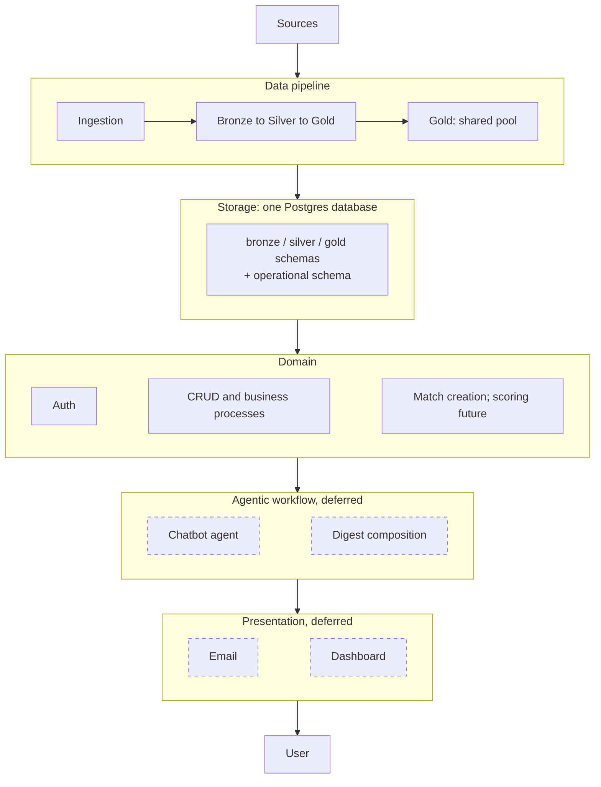
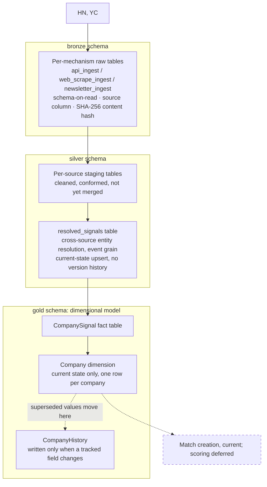
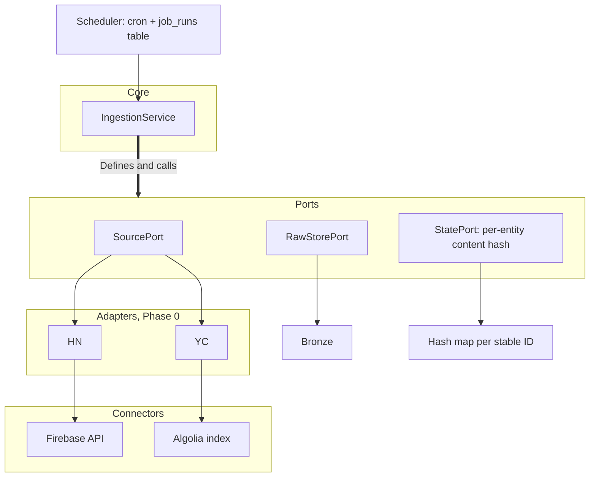
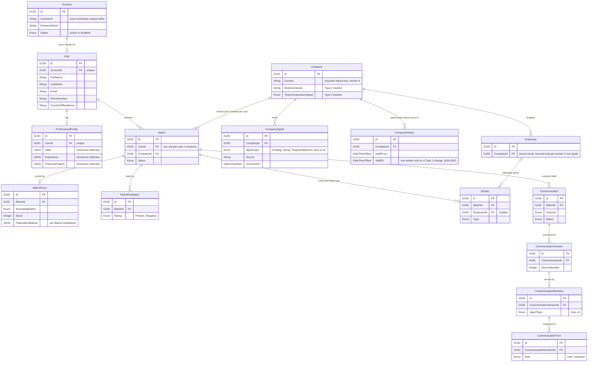

Status: DRAFT, partially implemented. Ingestion and the Bronze write path are built for HN, YC, OpenCorporates, and EU-Startups. Silver and Gold are wired end to end for HN, YC, and EU-Startups via `python -m huginn.elt`; OpenCorporates reaches Bronze but is not yet wired into Silver/Gold. The creation-only matchmaking module supports explicit operator batches; scoring, ranking, and digest delivery remain unbuilt. Architecture decided across a series of design sessions, September 2026.
Author: Khaled Awashreh

Supersedes [Huginn Diagrams](https://kawashreh.atlassian.net/wiki/spaces/Huginn/pages/950273/Huginn+Diagrams) v1.3 wherever its "Not yet specified" table has since been resolved below. Its diagrams are the historical source for this document's graphs. This document is the authoritative, current-state architecture.

Companion documents: [Huginn Concept Doc](https://kawashreh.atlassian.net/wiki/spaces/Huginn/pages/917506/Huginn+Concept+Doc) (v1.3, product vision, on Confluence), `docs/entities.md` (domain schema, in progress), `architecture-notes/` (supporting research), `adr/` (decision records), Jira epic KAN-16 (tracked tech debt and research debt). Full list in section 13.

Architecture at a glance:

1. Storage: one Postgres database. Three ELT schemas (bronze, silver, gold) feed a separate operational schema.
2. Ingestion: ports and adapters, three sources at launch, HN "Who's Hiring", the YC directory, and OpenCorporates.
3. Entity resolution: runs at silver, domain-key first, Jaro-Winkler/token-Jaccard fallback.
4. Matching: a synchronous operator batch creates missing per-User Matches from current ICPs and recent Gold signals. Scoring and ranking are future work.
5. Delivery: a weekly email digest is the product direction; digest composition and delivery are not implemented.
6. Out of scope this phase: everything above the domain layer (chatbot, dashboard, memory).

---

## 1. Problem and vision

1. Prospecting is the hardest part of running a solo services business, and often what stops people going independent at all: with no sales team it competes directly with billable work.
2. Startups are the high-fit case and the hard case at once. They lack the org charts, headcount plans, and formal recruiting processes that make bigger companies legible from outside, so the gap is visibility rather than fit, and the signal (funding, hiring, program milestones) is scattered and easy to miss on top of client work.
3. The answer is a Monday-morning email: a shortlist rather than a feed, pre-checked against criteria the user set, each entry carrying who the company is, why it surfaced, and a drafted outreach opener, learning over time what a "yes" and a "no" look like for this user.

Full problem statement and vision: [Huginn Concept Doc](https://kawashreh.atlassian.net/wiki/spaces/Huginn/pages/917506/Huginn+Concept+Doc) sections 1 and 2.

## 2. Goals and non-goals

Goals for this phase:

1. A weekly digest: a ranked shortlist of companies matching a plain-language ICP.
2. Per company: name, site, a LinkedIn search link (not scraped data), a short description, plain-language match reasoning, and a drafted outreach opener.
3. A domain model that's multi-user from day one, even though exactly one user exists right now. Phase 2 becomes additive, not a rebuild.
4. Ingestion from three sources: HN "Who's Hiring", the YC directory, and OpenCorporates.

Non-goals for this phase:

1. No CRM or outreach automation. The opener is a draft to edit and send, not something the system sends on its own.
2. No chatbot UI and no conversational ICP refinement. ICP capture is a one-time plain-text-to-structured-filter form.
3. No scraped LinkedIn profile data. Search-link only. `hiQ v. LinkedIn` is the standing reason, and the same caution extends to person-level scraping generally (section 6).
4. No real-time alerts. Weekly batch by design.
5. No graph-traversal or ML model predicting a company's current needs. Team-composition signal, where it exists at all, is a hand-authored heuristic drawn only from company-owned pages and press releases.
6. No scoring or ranking in the current matching slice (section 7).
7. No public registration, role-based access control, or billing. KAN-71 only
   establishes the Account/User/Profile storage and management runtime. KAN-72
   adds owner-only atomic provisioning and password hashing; KAN-73 adds login,
   server-side sessions, and ownership enforcement.

## 3. System overview

Five layers. The data pipeline feeds storage. Everything above it reads from storage.

Collection is shared infrastructure, matching is personal. The pipeline and the gold pool serve every user and are expensive to re-run, since sources rate-limit and some content becomes unavailable over time. Everything from the domain layer up is specific to one user and re-runnable at no cost.

Management is a separate application boundary, not a second production data
domain. Production retains the shared Postgres model shown above. Local
development uses `HUGINN_MANAGEMENT_DATABASE_URL` with a dedicated disposable
database so management bootstrap work does not disturb concurrent ELT work;
that database receives all six bootstrap files because operational foreign
keys still reference Gold.

Future scoring belongs in the domain layer: it is batch work, it must stay explainable per feature because a future digest may render its reasoning, and future consumers should read its output rather than each other's.

## 4. Data pipeline: bronze, silver, gold

One Postgres database carries three schemas, `bronze`, `silver`, and `gold`, alongside the operational schema described in section 9. No separate lake or warehouse: unjustified overhead at two sources and low request volume, and nothing here forecloses moving to one later if volume justifies it.

The generic medallion, schema-on-read, dimensional-modelling, and SCD patterns behind these layers are not restated here. The primary sources are collected in `architecture-notes/industry-references-elt-medallion.md`. What follows is only where Huginn makes a choice.

### 4.1 Bronze

1. Tables group by ingestion mechanism, not by source: `bronze.api_ingest`, `bronze.web_scrape_ingest`, `bronze.newsletter_ingest`. HN and YC are both `api` today. The candidate sources in [Huginn Concept Doc](https://kawashreh.atlassian.net/wiki/spaces/Huginn/pages/917506/Huginn+Concept+Doc) section 7 map to `web_scrape` (VC boards, Ramp, Harmonic) or `newsletter` (the four Substack feeds) when added.
2. Columns: `payload` (close to as-fetched, with documented adapter-level privacy filtering and no other field mapping or cleaning), `source` (`hn`, `yc`, and so on), fetch timestamp, run ID, `last_checked_at`. For example, the OpenCorporates adapter removes its potentially personal `officers` field before creating a `RawRecord` for Bronze persistence.
3. Watermarking is by content hash, because neither HN's Firebase API nor YC's Algolia backend offers a reliable changed-only cursor. A SHA-256 over a deliberately chosen, lightly normalized subset of each source's fields gives `(source, stable_id, content_hash)` where a native `updated_at` would sit. The `source` qualifier keeps two sources' native IDs from colliding in a shared table.
4. A fetch whose hash already exists writes nothing and bumps `last_checked_at` instead, which tells a healthy-but-static source apart from a job that has silently stopped running. A fetch whose hash differs overwrites the existing row in place: `UNIQUE (source, stable_id)` allows exactly one row per entity, so Bronze holds only the latest raw payload per entity, not every prior version.

### 4.2 Silver

1. Per-source staging tables, each conformed to a common shape but not merged across sources (ADR-0001), so HN's cleaning logic and YC's stay independently inspectable.
2. One cross-source `resolved_signals` table then runs entity resolution (section 6) at event grain, one row per original signal, raw company name replaced by a resolved canonical identifier.
3. No dimension/fact split at this layer. That is Gold's job, per Databricks and Kimball.
4. Current-state upsert only, no version history. Bronze does not preserve prior versions either, it holds only the latest raw payload per entity (section 4.1 point 4), so a wrong entity-resolution merge has no prior raw state anywhere in the pipeline to diagnose or roll back from. Accepted trade-off, revisit if it bites in practice.

### 4.3 Gold

A Kimball dimensional model over Silver's resolved signals: `Company` (dimension) and `CompanySignal` (fact), plus enrichment on the dimension (the team-composition/soft-signal heuristic, a Type 2 tracked field). That enrichment is not gated on an ICP verdict, because no verdict is held on this layer at all (ADR-0012, below).

`Company` covers every company Silver has resolved, whether or not it has been evaluated against a filter, and the row is never gated on passing: a company that later stops passing keeps its record. The pass/fail verdict itself is per-user, so it is not held on this shared dimension at all. ADR-0012 removed `IcpFilterPass` for exactly that reason; durable Match identity belongs to the per-User `Match` rows, with one row per User and Company enforced by `match_user_company_unique`.

History is a current-plus-history split rather than a single SCD Type 2 table (ADR-0002):

1. `Company`: exactly one row per company, always, overwritten in place whenever any field changes.
2. `CompanyHistory`: a new row only when a Type 2 tracked field changes (`BusinessSector`, `TeamCompositionSignal`), holding the superseded values with a `ValidFrom`/`ValidTo` window. ADR-0012 removed the third field, `IcpFilterPass`, because an ICP verdict is per-user.
3. Type 1 cosmetic fields: overwrite in `Company`, no history.

The reason for the split: every scoring read needs current state, and a single Type 2 table makes that read depend on remembering an `IsCurrent` filter every time. `Company` cannot return a stale row.

Column-by-column Type 1 / Type 2 classification is pending the concrete schema (Jira KAN-20). Enrichment's placement in Gold is provisional and may move in a later architecture pass.

### 4.4 Matching

The first matching slice is a synchronous Python batch capability in
`huginn.matchmaking`. It reads each requested User's active discovery
strategies and current ICPs, checks shared Gold companies against a required
signal window, and inserts new rows into `operational.match`. One transaction
covers each User; a unique `(user_id, company_id)` constraint makes repeated
runs safe and preserves existing Match status and notes.

Matchmaking is a sibling of management and ELT. Its explicit application APIs
are `MatchmakingService.execute(MatchmakingRequest) -> MatchmakingResponse`
and `MatchmakingBatchService.execute(BatchMatchmakingRequest) -> BatchMatchmakingResponse`.
`StrategyConfiguration`, `UserAvailability`, and `CompanyCandidate` are
application read models. SQL adapters own row validation; domain rules consume
criteria values and do not depend on application projections.

This slice does not rank candidates or deliver a digest. Existing Matches are
left unchanged, so this is creation-only matching and does not implement
resurfacing, sent-history checks, evidence snapshots, or reevaluation. The
operator entry point and required schema setup are documented in
[`matchmaking.md`](matchmaking.md). Scheduler integration remains future work.

## 5. Ingestion

A ports-and-adapters arrangement.

`IngestionService` holds the logic that would otherwise be reimplemented per adapter: which sources to fetch, in what order, and when a run counts as complete. Each adapter owns a single protocol.

Each adapter reaches its external API through a connector, a thin client constructed in `build_service` and injected, so an adapter holds ingestion policy and a connector holds transport. The two are separated because a connector has no notion of what it is fetching: `FirebaseConnector` knows the URL shape of a Firebase item and nothing about what makes a thread a "Who's Hiring" thread, while `AlgoliaConnector` owns its index's request bodies and the adapter owns which records become `RawRecord`s. Both stay stateless because the adapters call them concurrently from one shared instance (ADR-0003).

Both Phase 0 sources are API-shaped, not scraped HTML. HN's official Firebase API needs no auth and has no rate limit. YC's directory has no official API but exposes a public, search-only Algolia key in its frontend, which Huginn queries directly rather than parsing rendered pages. `StatePort` holds the content-hash map from section 4 in place of a source-provided cursor.

Orchestration is cron plus a `job_runs` table, the confirmed default at this scale. Prefect (self-hosted OSS) and GitHub Actions `schedule:` triggers are named upgrade paths, neither adopted now (Jira KAN-9). `python -m huginn.elt` is the pipeline entry point: Ingestion through Bronze, Silver staging and resolution, and Gold, run in dependency order and each recorded as its own `job_runs` row. `python -m huginn.elt.ingestion` remains available for an ingestion-only run. See adr/0014-pipeline-entry-point-and-stage-failure-policy.md for the entry point, the stage order and its dependency argument, and the dependency-aware skip-on-failure policy: a stage runs only if every stage it depends on succeeded, so one stage's failure does not block an unrelated stage.

One risk is carried forward unresolved rather than quietly assumed: YC's Terms of Service explicitly prohibit scraping and data-mining, while its `robots.txt` says nothing about querying the Algolia backend directly. YC is locked as a Phase 0 source, but the legal exposure underneath that choice has not been closed out (Jira KAN-7).

## 6. Entity resolution

Domain is the canonical key first. A company's registrable domain, normalized (lowercase, no `www.`, no protocol or trailing slash), is cheap and nearly unambiguous.

Where no domain match exists, the fallback is:

1. Normalize the name and strip legal suffixes (Inc., LLC, Ltd.), using OpenSanctions' suffix list rather than a hand-rolled one.
2. Score with Jaro-Winkler for character-level similarity plus token-Jaccard for word-order variance ("Acme Robotics" vs "Robotics Acme Inc").
3. Act on the Jaro-Winkler score: 0.92 and above auto-matches, 0.85 to 0.92 goes to a manual-review queue rather than an automatic decision, below 0.85 is treated as no match.

Full probabilistic record linkage (Splink, `dedupe`, Zingg) is deliberately deferred. That machinery earns its cost at a scale this system does not have: no training pairs, no meaningful class imbalance, and no throughput problem to justify it. The trigger to revisit it is a real, sizeable backlog in the manual-review queue.

This recipe was researched and adopted without the author's own background in entity resolution. Accepted as debt, tracked at Jira KAN-4, to be properly learned once that manual-review backlog exists.

## 7. Digest and scoring

Scoring and delivery remain future work. The matching slice currently returns
new Matches in deterministic Company UUID order and does not calculate scores,
compose digest items, or send email. The following design records the intended
direction; it is not implemented behavior:

1. A future first ranking may order eligible companies by their freshest qualifying signal. No ranking is produced by the current module.
2. A later weighted score may be considered after real filtered-data volume exists. Its inputs and weights remain open (Jira KAN-8); the current schema and service do not produce a score or qualitative tier.

Future evidence, recommendation occurrences, and sent-digest snapshots need separate lifecycle design. The current Match stores workflow status and notes, and later matching runs leave those fields unchanged. It has no score snapshot or sent-state freeze.

The feedback loop and digest delivery are not wired to the matching service.

## 8. Agentic workflow, retrieval, presentation: deferred

Out of scope for this phase and deliberately abstract pending a decision later. Carried forward for continuity:

1. A chatbot agent and digest composition would sit on a shared harness: an explicit, named tool contract, plus the model routing in section 10. Two experimental memory side-channels, MuninnDB and Letta, are named as candidates for soft context only, and the system has to keep working with both absent.
2. Retrieval, if a chatbot ships, would narrow with a structured filter before re-ranking by vector similarity, on the `pgvector` storage in section 10.
3. User-facing presentation remains deferred. A JSON operator CLI exists for
   explicitly requested batch runs; it is not a digest or dashboard. Dashboard
   scope is undecided.

## 9. Data model

`docs/entities.md` holds the domain schema and is the source for the diagram below, which shows identifying fields only. Its "Gold" heading predates this document's pipeline layering and mixes two things this document separates: the ELT Gold layer (section 4), which is `Company`, `CompanyHistory`, and `CompanySignal`, and the operational schema below them, including Match rows written by the matching module rather than the ELT pipeline.

The management API uses FastAPI with Uvicorn, generated OpenAPI, native
sanitized HTTP 422 validation, and synchronous psycopg calls in FastAPI's
worker threads. Werkzeug is an explicit dependency for scrypt password
hashing. The API has an inert application factory, readiness probes, and
authenticated User/Profile, offering, ICP, and discovery-strategy workflows.
Its package roots are `presentation` (HTTP and owner CLI), `application`
(use cases), `domain` (pure entities, values, and policy), `persistence`
(repository contracts and implementations, row models, and database/transaction
contracts), and `security` (passwords and tokens). Presentation calls application
services; application depends on persistence contracts and domain values.
Persistence repositories depend on domain and database contracts. Only
`persistence/database/client.py` imports psycopg; `app.py` selects and wires the
concrete adapters without startup I/O. Persistence is a first-class layer.
The replaceable client boundary preserves the fixed PostgreSQL dialect,
handwritten SQL, JSONB, constraints, and row locks. See the
[management package tree](management-foundation.md#management-package-layers).
Unique foreign keys enforce at most one User per Account and at most one
ProfessionalProfile per User; owner provisioning creates the full aggregate
atomically. Its login throttle is process-local, so the runtime is
single-process until throttle state is shared. These management stages do not
alter or run the ELT pipeline.
`Match.UserId` remains a reference to User, not Account.

`MatchScore` as currently sketched is a single row per match. Section 7's recompute design will need it to grow into a versioned history before v1 scoring ships.

## 10. Cross-cutting concerns

| Concern | Decision |
|---|---|
| Secrets | Behind an abstracted provider. Local key vault now, remote later. |
| Configuration | YAML. Framework not yet chosen. |
| Deployment | Local for now, containerized later. |
| Vector storage | `pgvector` on Postgres, no separate infrastructure, if retrieval ships. |
| Model cost | Small models for background work, the larger model reserved for user-facing chat, if it ships. |

These carry forward unrevisited from the original diagram set.

## 11. Open items

| Item | Area | Tracking |
|---|---|---|
| v1 scoring: feature list and weights | Domain | KAN-8 |
| Matching-step logic: resurfacing check, ICP/preference reapplication | Domain | KAN-18 |
| Gold Type 1 / Type 2 column classification, concretely | Data pipeline | KAN-20 |
| YC ToS-vs-robots.txt legal exposure | Ingestion | KAN-7 |
| Team-composition inference method, concretely | Data pipeline | not tracked |
| ICP capture flow, concretely (the one-time form) | Domain | not tracked |
| Enrichment's long-term home (currently Gold, provisional) | Data pipeline | not tracked |
| Contents of the agentic workflow layer | Agentic | not tracked |
| Shared or separate embedding spaces | Retrieval | not tracked |
| Whether digest and any future notifications share one delivery mechanism | Presentation | not tracked |
| Dashboard scope | Presentation | not tracked |
| Concrete table columns and types | Data model | not tracked |
| A formal constraint against person-level fields sourced from third parties | Data model | not tracked |
| Testing approach for normalization and entity resolution | Cross-cutting | not tracked |
| Logging and error visibility as one story | Cross-cutting | not tracked |

Resolved since the original diagram set, kept for continuity: first two sources (HN, YC), entity resolution strategy (section 6), orchestration mechanism (cron plus `job_runs`), and the v0 half of the scoring mechanism (section 7).

## 12. Tracked debt and research

Jira epic KAN-16 holds tech debt (tools and libraries chosen without deep review, for example the entity-resolution recipe in section 6) and research debt (patterns and conventions worth learning properly, for example the SCD taxonomy behind section 4's Gold layer). Decisions with a settled rationale live in this document; open gaps live in Jira.

## 13. References

1. [Huginn Concept Doc](https://kawashreh.atlassian.net/wiki/spaces/Huginn/pages/917506/Huginn+Concept+Doc) (Confluence): product vision and phased approach.
2. [Huginn Diagrams](https://kawashreh.atlassian.net/wiki/spaces/Huginn/pages/950273/Huginn+Diagrams) (Confluence): original diagram set this document supersedes where resolved.
3. `docs/entities.md`: domain schema in progress.
4. `architecture-notes/data-pipeline-standards.md`: entity resolution, watermarking, orchestration, and observability research.
5. `architecture-notes/elt-pipeline-and-scoring-decisions.md`: the pipeline and scoring design session behind sections 4 and 7.
6. `architecture-notes/industry-references-elt-medallion.md`: Databricks, Kimball, dbt, and Fivetran primary sources this document's pipeline design is checked against.
7. `docs/sources/*.md`: per-source access and risk findings.
8. Jira epic KAN-16: tracked tech debt and research debt.
9. `adr/0001-per-source-silver-staging-tables.md`, `adr/0002-gold-current-history-split.md`, and `adr/0012-icp-verdict-not-on-company-dimension.md`: decision records for the Silver and Gold layer designs above. ADR-0012 governs section 4.3's `Company` and `CompanyHistory` columns.
10. `adr/0006-split-signal-resolver-scope-for-network-io.md`, `adr/0007-company-signal-idempotency-key.md`, and `adr/0013-gold-company-write-shapes.md`: decisions this document does not restate because they are narrower than a section. ADR-0006 holds the network call in `SignalResolver` outside any open database scope, which is why the resolver is absent from section 6 rather than described there. ADR-0007 fixes the `gold.company_signal` uniqueness that makes a re-run idempotent. ADR-0013 splits the `gold.company` write into an insert shape and an update-only shape, keyed on `name`.
