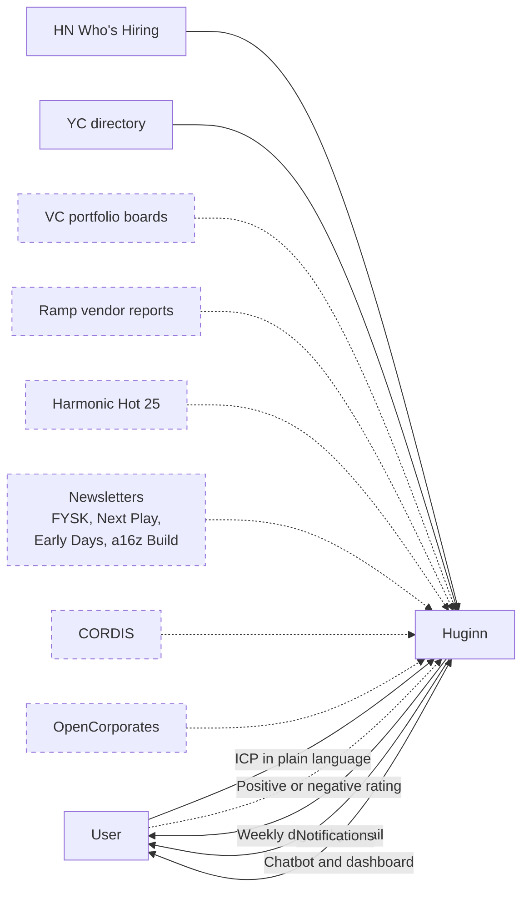
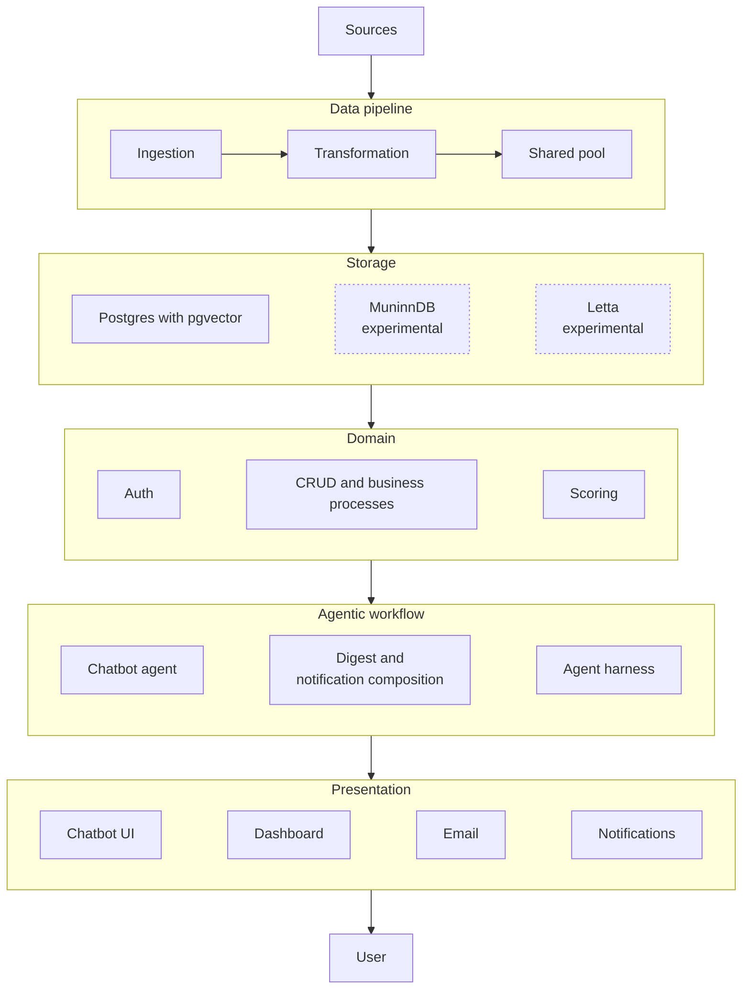
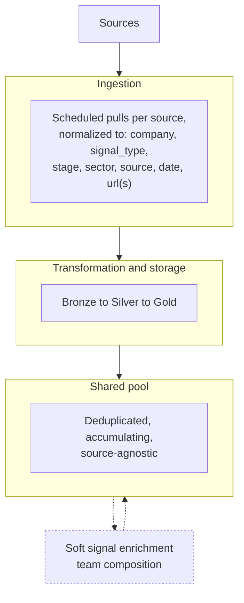
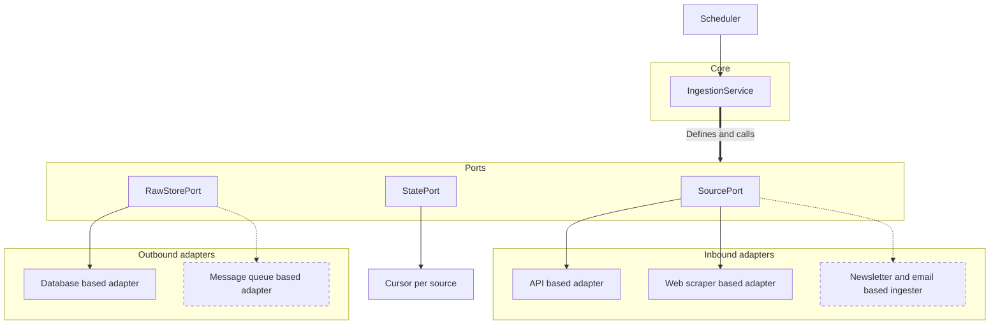
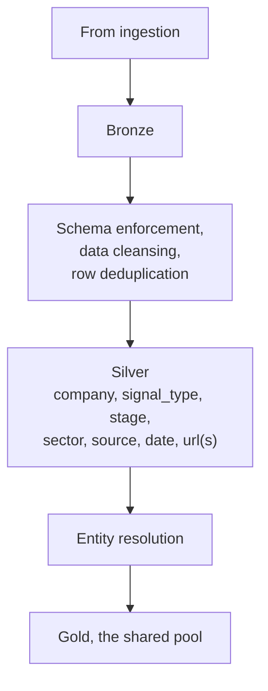
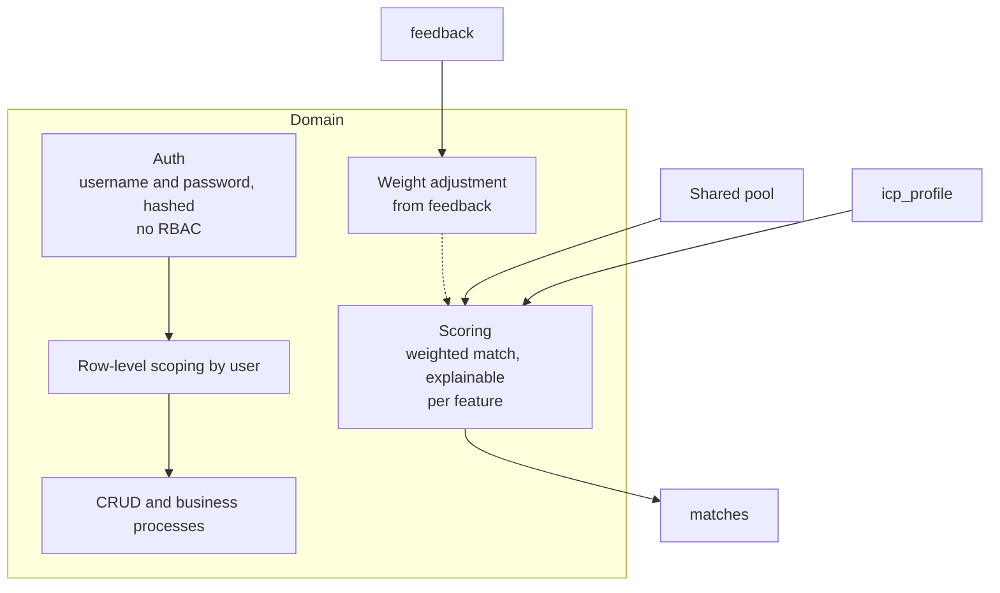
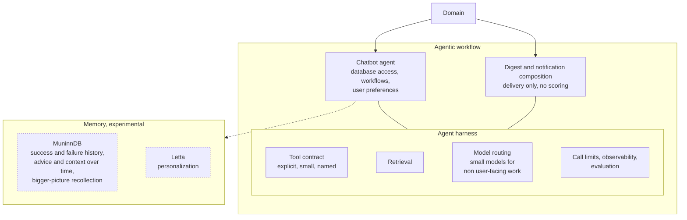
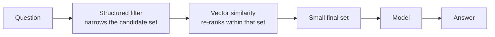
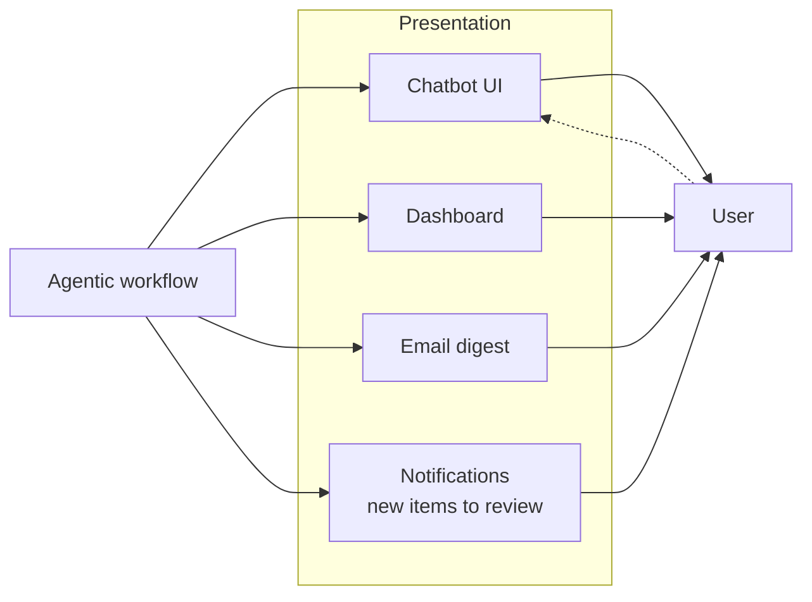
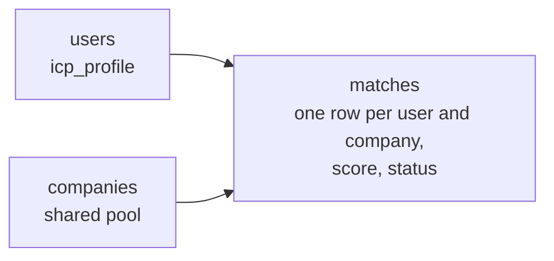

 # Huginn Diagrams

Accompanies `huginn-concept-doc.md` v1.3.
Diagrams are written in Mermaid and render in Obsidian, GitHub and GitLab without a build step.

**Line styles.** Solid lines indicate components in scope for Phase 0. Dashed lines indicate components deferred to a later phase. Dotted lines indicate items that are unresolved, abstract or experimental.

---

## 1. Context

Signal sources and the boundary of the system.

Phase 0 ingests Hacker News and the YC directory only. The remaining sources are introduced in later phases, one at a time.

---

## 2. System overview

Five layers. The data pipeline feeds storage; everything above it reads from storage.

Collection is shared infrastructure and matching is personal. The pipeline and the shared pool serve every user and are expensive to re-run, since sources rate-limit access and some content becomes unavailable over time. Everything from the domain layer upward is specific to a single user and can be re-run at no cost.

The domain layer sits above storage and below the agentic layer. Scoring lives in the domain layer rather than the agentic layer: it is batch work, it must remain explainable per feature because the digest renders its reasoning, and both the chatbot and the digest read its output rather than each other's.

MuninnDB and Letta are experimental memory side channels holding soft context only. The pipeline, scoring and domain data must continue to work in their absence, so nothing load-bearing reads from either.

---

## 3. Data pipeline

Ingestion, transformation and the shared pool.

Soft signal enrichment is the one genuinely multi-step, model-backed task in the pipeline. Team composition is never stated directly by a source and has to be inferred from indirect evidence, which requires gathering several pieces of evidence and combining them rather than a single extraction call.

It sits in the pipeline rather than the agentic layer because team composition is a property of a company, not of a particular user's match. Computing it once and storing it against the company means every user's scoring reads it as an ordinary field, and the domain layer never has to call upward into the agentic layer.

The method is unresolved.

---

## 4. Ingestion

A ports and adapters arrangement. The core defines the interfaces and the adapters implement them.

`IngestionService` holds the logic that would otherwise be reimplemented in each adapter: which sources to fetch, in what order, and the conditions under which a run is considered complete. Adapters are responsible for a single protocol, whether HTTP, HTML, IMAP or SQL, and hold no ingestion policy of their own. Adding a source therefore means writing one adapter against an existing interface rather than modifying the core.

`StatePort` maintains a cursor for each source so that a run retrieves only the records that have appeared since the previous run. Without it, every run performs a full retrieval, which sources rate-limit and which cannot recover content that has already rolled off.

The two ingestion strategies, live retrieval and periodic newsletter parsing, are both implementations of `SourcePort`. Phase 0 requires the API and web scraper adapters. The newsletter adapter and the message queue adapter are deferred.

---

## 5. Transformation

Three storage tiers, with the processing carried out on the transforms between them.

Deduplication occurs twice, at different tiers and by different means:

| Step | Tier | Question | Method |
|---|---|---|---|
| Row deduplication | Bronze to Silver | Has this exact payload already been ingested? | Exact match |
| Entity resolution | Silver to Gold | Do these records refer to the same company? | Probabilistic |

The second step determines whether a company appears in the digest once or once per source. The concept doc currently treats it as a single property of the pool, described only as "deduplicated". It is substantially the harder of the two and remains unresolved.

---

## 6. Domain

Business processes, authentication, and scoring.

Authentication is username and password with hashing. Role-based access control is out of scope for now, which makes row-level scoping by user the requirement that has to hold in its place: every query is constrained to a single user's own ICP profile, matches and feedback. Payment is out of scope entirely.

Scoring reads the shared pool and the user's ICP profile and writes `matches`. It has to decompose into per-feature contributions, because the digest renders match reasoning in plain language and a score that cannot say which feature fired cannot be explained. The mechanism itself, meaning the features, weights and initial values, is unresolved and is the highest-value open piece in the system.

---

## 7. Agentic workflow

Two paths over the same domain data, on a shared harness. Contents are deliberately abstract pending a decision.

The email path carries no scoring logic of its own. It selects from the matches scoring has already produced and composes them for delivery.

The chatbot path is the one with genuine agency. Its capabilities are bounded by an explicit tool contract, following the same discipline as the ingestion ports: the agent can do only what the contract names.

Model routing reserves the larger model for the user-facing chatbot and uses smaller models for high-volume background work such as extraction and normalization. The model call sits behind an interface so it is swappable per task.

Memory is experimental and split across two tools. MuninnDB holds what has worked and what has not, advice and context accumulated over time, and recollection of previous attempts. Letta holds personalization. Both carry soft context only, and nothing else in the system reads from either.

---

## 8. Retrieval

Structured filtering narrows first; vector similarity selects within the narrowed set.

Two distinct problems make both steps necessary. Structured filtering alone cannot rank by resemblance, since similarity in spirit to another company is not expressible as a filter condition. Vector search alone does not keep the context small, and returning a large unranked set into the prompt is the failure mode this ordering exists to prevent.

The corpus is company records, company history, signal data, industry context and country context. Vectors live in Postgres via pgvector rather than in separate infrastructure. Whether entity resolution and chatbot retrieval share one embedding space or use two is unresolved.

---

## 9. Presentation

Surfaces the user interacts with.

The email digest and the notifications are two delivery paths with the same failure mode, namely double sending or silent dropping. Whether they share one mechanism or remain separate is unresolved.

Scope of the dashboard is undecided. With a single user the realistic scope is a simple page alongside email rather than a full dashboard application.

---

## 10. Data model

Structured for multiple users from the outset.

Ingestion and scoring remain decoupled from the question of who is using the system, so introducing additional users in a later phase requires no change to either.

---

## Cross-cutting

| Concern | Decision |
|---|---|
| Secrets | Behind an abstracted provider. Local key vault now, remote later |
| Configuration | YAML. Framework not yet chosen |
| Deployment | Local for now, containerized later |
| Vector storage | pgvector on Postgres, no separate infrastructure |
| Model cost | Small models for background work, larger model for the chatbot only |

---

## Not yet specified

| Item | Area |
|---|---|
| Scoring mechanism: features, weights, initial values | Domain |
| ICP capture flow: onboarding, conversational refinement, or both | Domain and agentic |
| Team composition inference method | Data pipeline |
| Entity resolution strategy | Transformation |
| First two sources (blocking) | Ingestion |
| Newsletter ingestion approach | Ingestion |
| Orchestration and scheduling mechanism | Ingestion |
| Contents of the agentic workflow layer | Agentic |
| Shared or separate embedding spaces | Retrieval |
| Whether digest and notifications share one delivery mechanism | Presentation |
| Dashboard scope | Presentation |
| Table columns and types | Data model |
| Constraint prohibiting person-level fields | Data model |
| Testing approach for normalization and entity resolution | Cross-cutting |
| Logging and error visibility as one story | Cross-cutting |
